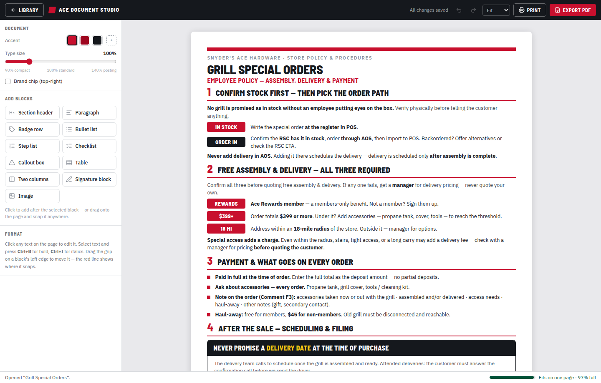
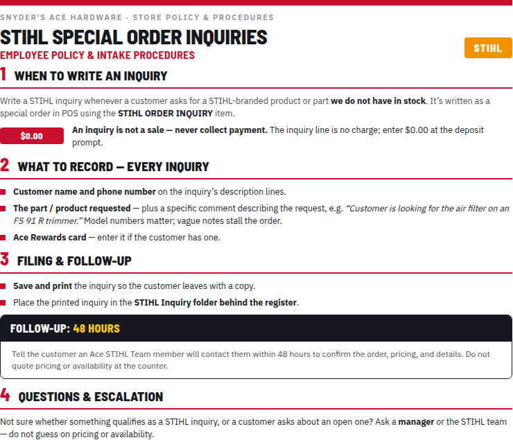

# Ace Document Studio

A Windows desktop app for **Snyder's Ace Hardware (Media, PA)** that designs
store **policy, procedure & store documents** — the same look, fonts, and layout
as the store's existing Policy & Procedures Guide, with drag-and-drop sections, a
new-document wizard, a live one-page fit meter, and print-ready PDF export.
Built to feel like a sibling of [Ace Sign Studio](https://github.com/codysuter/ace-sign-studio):
controls on the left, a live page on the right, and Print / Export PDF one click away.

> Formerly **Ace Policy Studio** — same app, broader name. On first launch the
> renamed app automatically copies your existing documents over from the old
> `Ace Policy Studio` data folder.

| Download |
|---|
| [**AceDocumentStudio.exe**](https://github.com/codysuter/codysuter/releases/download/ace-document-studio-windows/AceDocumentStudio.exe) — Windows 10/11, portable, no install |

> The link serves the latest build, published automatically by GitHub Actions
> (see [`.github/workflows/build-document-studio-windows.yml`](../.github/workflows/build-document-studio-windows.yml)).
> On first launch Windows SmartScreen may warn about an unrecognized app (it's
> unsigned) — click **More info → Run anyway** (once).



## What's inside

- **Your library, pre-loaded.** First launch seeds the three existing store
  policies — Grill Special Orders, STIHL Special Order Inquiries, and Special
  Orders for Pickup — converted 1:1 from the original designs, ready to edit or
  use as reference.
- **The exact design language.** Barlow Semi Condensed + IBM Plex Sans are
  bundled (no internet needed), with the numbered red-rule sections, badge
  pills, square bullets, dark callout boxes with brand-yellow highlights, brand
  chips (like the orange STIHL tag), and the 8px accent bar — all at the
  original sizes and spacing.
- **Drag, drop, snap.** Grab any block by its grip handle and drag — blocks
  glide apart and a red line shows exactly where it'll snap. Drag new blocks in
  from the left panel, or just click one to add it.
- **Click anything to edit.** Title, badges, bullets, callouts — it's all
  editable in place. **Ctrl+B** bold, **Ctrl+I** italics, **Ctrl+H** yellow
  highlight inside a callout bar. Sections renumber themselves automatically.
- **New Document goes straight to work.** One click opens the editor with a
  ready-to-edit policy outline — title, numbered sections, badge rows, and the
  warning callout already in place. No forms first.
- **One-page focus.** A live meter shows how full the page is; if content
  spills, a dashed "PAGE 2 STARTS" line appears right where the break lands.
- **Block library**: section headers, paragraphs, badge rows, bullet lists,
  numbered step lists, checklists, dark callouts, tables, **two-column
  sections** (each column with its own heading, text, and lists — great for
  DO / DON'T), **agreement signature blocks** in the exact style of the Radio &
  Scanner Policy Contract (sign-above-the-line rows, date column, wide lines
  for serial numbers), and images (stored inside the document, auto-scaled).
- **Print & PDF** through Chromium's print engine: Letter paper, 0.4″ margins,
  full-bleed color — identical geometry to the original documents.
- **Autosave, undo/redo, duplicate, a type-size slider** (90–140%: compact
  handbook pages through big customer postings), and per-document accent color
  (Ace red, dark red, ink).



## Where documents live

Documents are plain JSON files in
`%APPDATA%\Ace Document Studio\documents\` — easy to back up or copy between
machines. PDFs export wherever you choose (defaults to Documents). If you used
the app back when it was Ace Policy Studio, your documents are copied over from
the old folder automatically on first launch.

## Keyboard shortcuts

| Keys | Action |
|---|---|
| `Ctrl+N` | New document (opens the editor with a fresh outline) |
| `Ctrl+L` | Back to library |
| `Ctrl+E` | Export PDF |
| `Ctrl+P` | Print |
| `Ctrl+Z` / `Ctrl+Shift+Z` | Undo / redo |
| `Ctrl+B` / `Ctrl+I` | Bold / italic (in text) |
| `Ctrl+H` | Yellow highlight (in a callout bar) |
| `Delete` | Remove the selected block |
| `Enter` / `Backspace` | Add / remove list items |

## Building from source

```bash
cd ace-document-studio
npm install
npm run dev:app     # live-reload app (Vite + Electron)
npm run dist:win    # portable AceDocumentStudio.exe → release/
```

Other scripts: `npm run dev` (browser-only dev server), `npm run typecheck`,
`npm run build` (renderer), `npm test` (Playwright E2E against the built
renderer), `node scripts/electron-smoke.mjs` (boots the real app and runs a
production `printToPDF`), `npm run icon` (regenerates `build/icon.*`).

## How it's built

Electron 43 + React 19 + Vite + Tailwind 4, `@dnd-kit` for drag-and-drop,
`zustand` for state. Documents render from a small block model through one
`PageView` component used everywhere — the editor, the library thumbnails, and
the hidden print window — so what you see is exactly what prints. CI builds and tests on a real Windows runner (renderer E2E + an
Electron smoke test that seeds the library and exports a PDF) before every
release.
