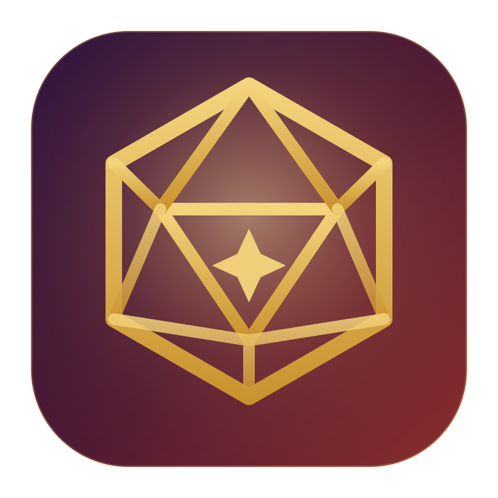

# 🎲 Loreforge

A **macOS desktop app** for building TTRPG campaign worlds — a Notion-style block
editor and worldbuilding database purpose-built for **D&D 5E (2024)** and
**Daggerheart**, with the campaign-management niceties of D&D Beyond, Demiplane,
and World Anvil baked in.

Built with Electron, React, BlockNote, and [Convex](https://convex.dev) (no auth —
it's your personal forge).



## What it does

**Notion-style workspace**
- Infinite nested pages with drag-and-drop reordering & re-parenting
- Block editor: headings, lists, toggles, quotes, tables, images, files, code, dividers
- Slash menu (`/`), drag handles, page icons (emoji), gorgeous gradient or image covers
- Full Notion-style **databases**: Table, Gallery, and Board views; property types
  (text, number, select, multi-select, checkbox, date, URL, **dice formula**,
  **link to page/entry**); filters, sorting, grouping; every row opens as its own
  page with content
- Favorites, trash with restore, ⌘K quick switcher with full-text search,
  back/forward history, duplicate, breadcrumbs
- Dark & light themes

**Worldbuilding database (the World Anvil part)**
- **@mentions** link any page or database entry from anywhere — type `@`
- **Backlinks**: every page shows "Mentioned in", kept in sync server-side
  (mentions, map pins, timeline links, and relation columns all count)
- **Interactive maps** with draggable colored pins that link to pages — upload an
  image or sketch on parchment
- **Timelines** with colored eras and events that link to pages
- Two fully-built starter worlds show the structure: atlas, characters, factions,
  bestiary/adversaries, quests, sessions, history, GM screen, rules reference

**At the table (the D&D Beyond / Demiplane part)**
- **Dice everywhere**: inline rollable dice chips in any text, a floating dice
  tray (⌘J) with modifiers, advantage/disadvantage, custom expressions
  (`4d6kh3+2`), and a persistent roll log
- **5E stat blocks** with click-to-roll ability checks (⇧ advantage, ⌥ disadvantage)
  and auto-rollable attack/damage text
- **Daggerheart adversary & environment cards** with Duality-aware features
- **Duality dice**: 2d12 Hope/Fear with crit detection, advantage d6, and
  Hope/Fear-tinted results
- **Roll tables** that highlight the rolled row, **encounter/initiative tracker**
  (or spotlight tracker in Daggerheart mode), **HP/Hope/Fear/Stress trackers**,
  spell/ability/domain cards, GM-secret callouts
- Two **modes** — each workspace is D&D 5E (2024) or Daggerheart, switching the
  accent palette, dice defaults, slash-menu ordering, and starter content

## Quick start

```bash
cd loreforge
npm install
npm run dev        # starts Convex + Vite + Electron together
```

The first `npm run dev` asks how you want to run Convex:

- **"Start without an account"** (local) — everything stays on your machine.
  A local Convex backend runs while `npm run dev` is running.
- **Convex account** (free) — creates a cloud dev deployment, and your worlds
  are reachable from any build of the app.

Either way the CLI writes `VITE_CONVEX_URL` to `.env.local` and the app connects
automatically. On first launch Loreforge seeds **two starter worlds** —
*Emberfall* (D&D 5E) and *The Withered Vale* (Daggerheart) — so you can explore
every feature immediately.

> **Demo mode**: launch without any Convex URL and choose *"Explore in demo
> mode"* — the entire backend runs in-memory in the app (data resets on quit).
> Great for a look around.

### Building the macOS app

```bash
npm run dist:mac         # .dmg + .zip for Apple Silicon and Intel in release/
```

The app is unsigned (it's a personal tool). First launch: right-click the app →
**Open**, or run `xattr -cr /Applications/Loreforge.app`.

If you build against a **cloud** dev deployment, the URL is baked in and the
packaged app just works. If you use a **local** Convex deployment, keep
`npx convex dev` running while using the packaged app — or paste a deployment
URL into the connect screen at any time.

## Scripts

| Command | What it does |
|---|---|
| `npm run dev` | Convex + Vite + Electron, hot reload |
| `npm run dev:web` | Convex + Vite only (browser at `localhost:5173`) |
| `npm run test` | Unit tests (dice engine) + backend tests (convex-test) |
| `npm run e2e` | Playwright smoke test of the full app (demo mode) |
| `npm run typecheck` | TypeScript across app + backend |
| `npm run dist:mac` | Build the macOS .dmg/.zip |

## Architecture

```
loreforge/
├─ electron/          # main process (menu, shortcuts, window) + preload
├─ convex/            # schema + server functions (pages, entries, links,
│  │                  #   search, rolls, files, seed) — all tested
│  └─ seedData/       # the two starter worlds
├─ src/
│  ├─ lib/            # dice engine, data layer, store, covers, emoji
│  ├─ components/
│  │  ├─ editor/      # BlockNote schema + 9 custom TTRPG blocks + @mentions
│  │  ├─ database/    # table/gallery/board views, cells, entry peek
│  │  ├─ layout/      # sidebar tree, topbar, trash, toasts
│  │  ├─ dice/        # dice tray
│  │  └─ ...
│  └─ styles/         # design system (dark/light × D&D/Daggerheart accents)
└─ e2e/               # Playwright smoke suite + icon generator
```

**Data layer**: one tiny interface (`watch/queryOnce/mutation/uploadFile`) with
two implementations — a real `ConvexReactClient`, and a demo client that runs
the actual Convex functions in-memory in the browser via `convex-test`. The
same backend code is exercised by unit tests, demo mode, and production.

**Backlinks**: saving content walks the BlockNote JSON server-side and rewrites
a `links` table (mentions, map pins, timeline links, relation cells), so
"Mentioned in" is always consistent — the World Anvil trick, done atomically.

## Licenses & attribution

- Code: MIT.
- The D&D rules-reference pages adapt material from the **SRD 5.2.1**,
  © Wizards of the Coast LLC, under **CC-BY-4.0**.
- Daggerheart™ reference summaries are paraphrased unofficial fan content per
  the **Darrington Press Community Gaming License**; sample domain cards are
  original homebrew. This project is not affiliated with Wizards of the Coast,
  Critical Role, or Darrington Press.
